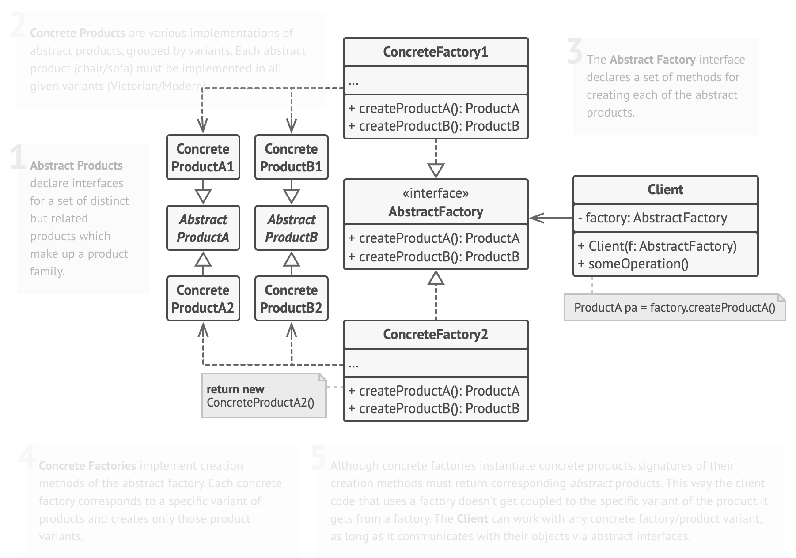

# Abstract factory

The abstract factory pattern provides a way to encapsulate a group of individual factories that have a common theme
without specifying their concrete classes. In normal usage, the client software creates a concrete implementation of
the abstract factory and then uses the generic interface of the factory to create the concrete objects that are part of
the theme. The client does not know (or care) which concrete objects it gets from each of these internal factories,
since it uses only the generic interfaces of their products. This pattern separates the details of implementation of
a set of objects from their general usage and relies on object composition, as object creation is implemented in methods
exposed in the factory interface.

