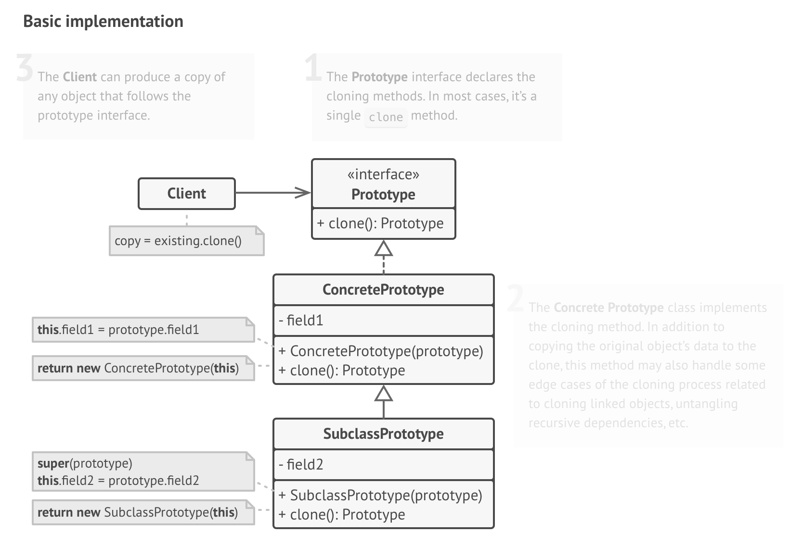
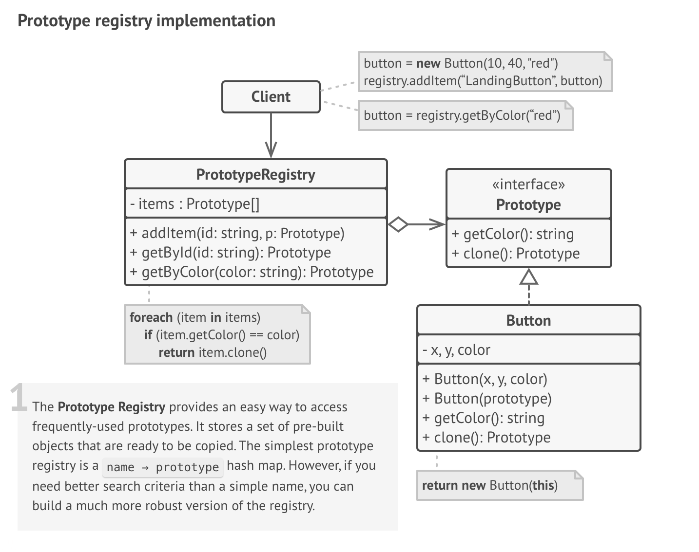

# Prototype

The prototype pattern is a creational design pattern in software development. It is used when the type of objects to
create is determined by a prototypical instance, which is cloned to produce new objects. This pattern is used to avoid
subclasses of an object creator in the client application, like the factory method pattern does and to avoid the
inherent cost of creating a new object in the standard way (e.g., using the 'new' keyword) when it is prohibitively
expensive for a given application.

