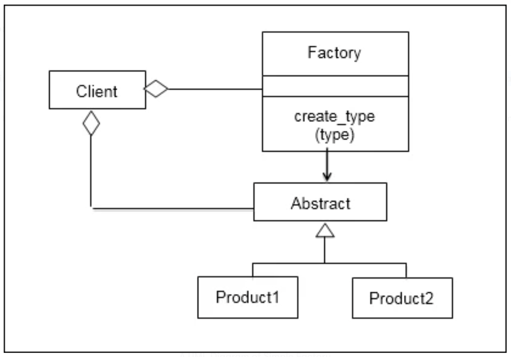

# Simple factory

For some, Simple Factory is not a pattern in itself. It is more of a concept that developers need to know before they
know more about the Factory method and Abstract Factory method. The Factory helps create objects of different types
rather than direct object instantiation.

