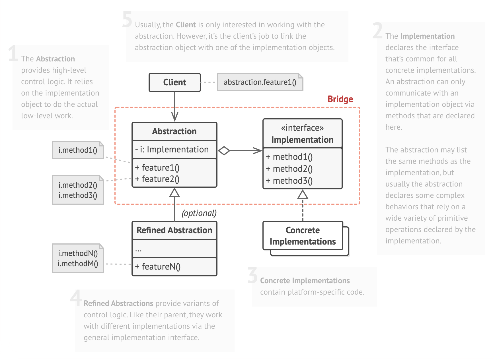

# Bridge

The bridge pattern is a design pattern used in software engineering that is meant to "decouple an abstraction from its
implementation so that the two can vary independently". The bridge uses encapsulation, aggregation, and can use
inheritance to separate responsibilities into different classes.

When a class often varies, the features of object-oriented programming become very useful because changes to a program's
code can be made easily with minimal prior knowledge about the program. The bridge pattern is useful when both the class
and what it does vary often. The class itself can be thought of as the abstraction and what the class can do as the
implementation. The bridge pattern can also be thought of as two layers of abstraction.

