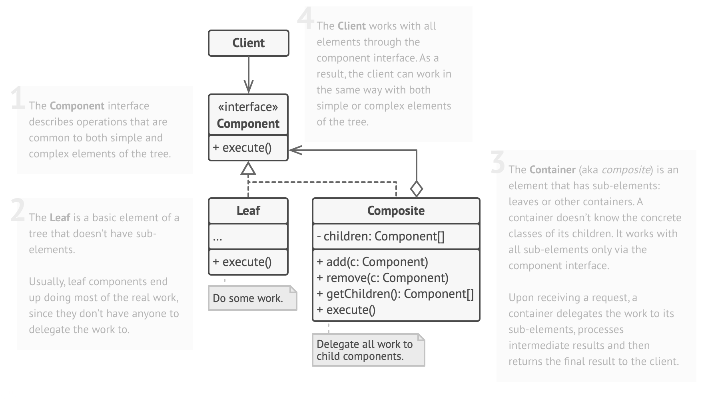

# Composite

In software engineering, the composite pattern is a partitioning design pattern. The composite pattern describes a group
of objects that are treated the same way as a single instance of the same type of object. The intent of a composite is
to "compose" objects into tree structures to represent part-whole hierarchies. Implementing the composite pattern lets
clients treat individual objects and compositions uniformly.

