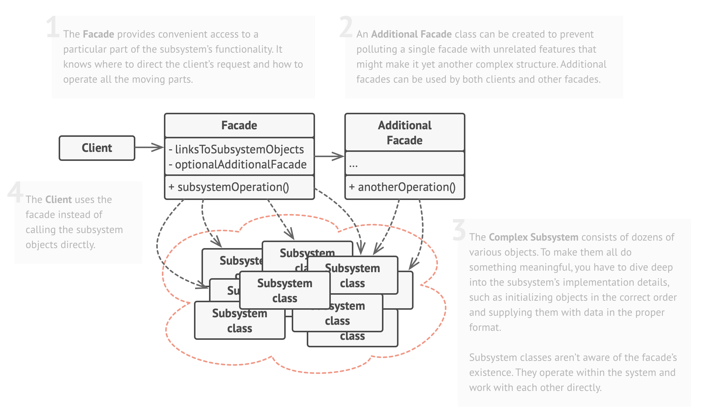

# Facade

The facade pattern is a software-design pattern commonly used in object-oriented programming.
Analogous to a facade in architecture, a facade is an object that serves as a front-facing interface masking more
complex underlying or structural code. A facade can:

- improve the readability and usability of a software library by masking interaction with more complex components behind a
single (and often simplified) API 
- provide a context-specific interface to more generic functionality (complete with
context-specific input validation)
- serve as a launching point for a broader refactor of monolithic or tightly-coupled systems in favor of more
loosely-coupled code 

Developers often use the facade design pattern when a system is very complex or difficult to
understand because the system has many interdependent classes or because its source code is unavailable. This pattern
hides the complexities of the larger system and provides a simpler interface to the client. It typically involves a
single wrapper class that contains a set of members required by the client. These members access the system on behalf of
the facade client and hide the implementation details.

